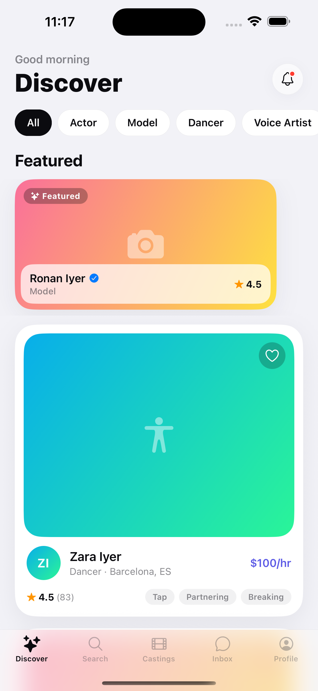
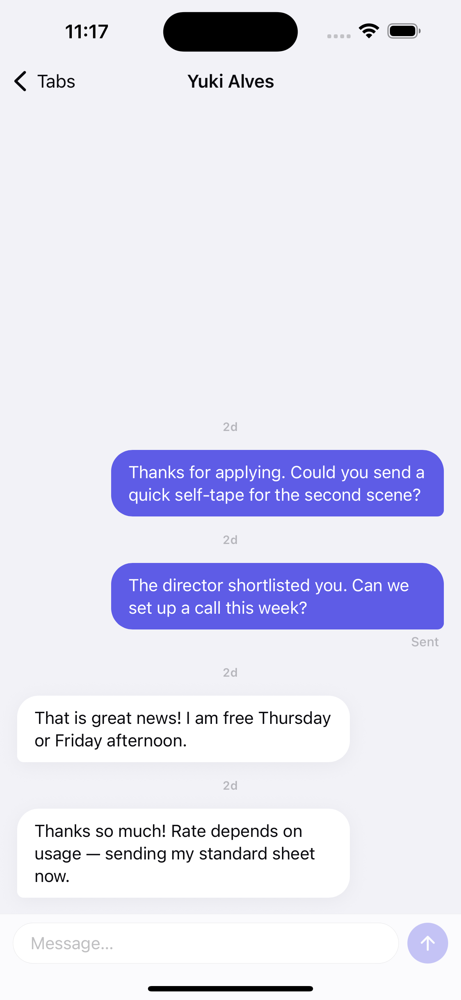

# TalentMatch

An iOS-26-style **mock casting app** built with Expo + TypeScript + Redux Toolkit. Fully offline by design — every talent, casting call, chat, and notification is generated locally with a seeded PRNG, so the app runs with zero backend, zero APIs, and zero remote images.

Built as a design-inspiration playground: liquid-glass surfaces, skeleton shimmer loading, optimistic UI everywhere, spring physics, and haptics.

<p align="center">
  
  &nbsp;&nbsp;
  
</p>

## Features

- **Discover** — paginated talent feed with featured carousel, category filters, and animated favorites
- **Search** — debounced instant search with role/verified/availability/rate filters and recent searches
- **Talent profiles** — immersive gradient heroes, stats, credits, generated portfolio grids
- **Castings** — job feed + detail, saved jobs, and a fake apply flow: native form sheet → instant optimistic success → application auto-advances to "In review" with notifications
- **Inbox** — conversations with unread badges, optimistic message send, typing indicator, auto-replies
- **Notifications** — grouped read/unread with deep links into jobs and talent
- **Profile** — editable, persisted profile with live avatar preview

Every list implements the full state cycle: skeleton → content / empty / error-with-retry, plus pull-to-refresh and infinite scroll. The fake API adds real latency and an intentional ~6% failure rate so loading and error states actually appear.

## Stack

| | |
|---|---|
| Runtime | Expo SDK 54 · React Native 0.81 · TypeScript (strict) |
| State | Redux Toolkit (7 slices, async thunks, optimistic updates) |
| Navigation | React Navigation 7 — native stack + blur bottom tabs, native form sheets |
| Motion | Reanimated 4 (shimmer, springs, layout transitions) + expo-haptics |
| Persistence | AsyncStorage (favorites, saved jobs, applications, profile, read-state) |
| Visuals | expo-blur, expo-linear-gradient — all "photos" are generated gradients |

## Run it

```bash
npm install
npx expo start
```

Then press `i` for the iOS simulator (or scan the QR code in Expo Go).

## Architecture

```
src/
  theme/        design tokens (colors, type ramp, radii, shadows, gradients)
  types/        domain models
  data/         seeded PRNG + generators (60 talents, 36 castings, chats, notifications)
  api/          fakeApi — latency, pagination, simulated failures
  store/        slices + AsyncStorage persistence
  navigation/   typed stack + tabs
  components/   shared UI kit (Skeleton, PressableScale, HeartButton, …)
  features/     one folder per feature (discover, search, talent, jobs, favorites, inbox, notifications, profile)
```

## License

[MIT](LICENSE)
